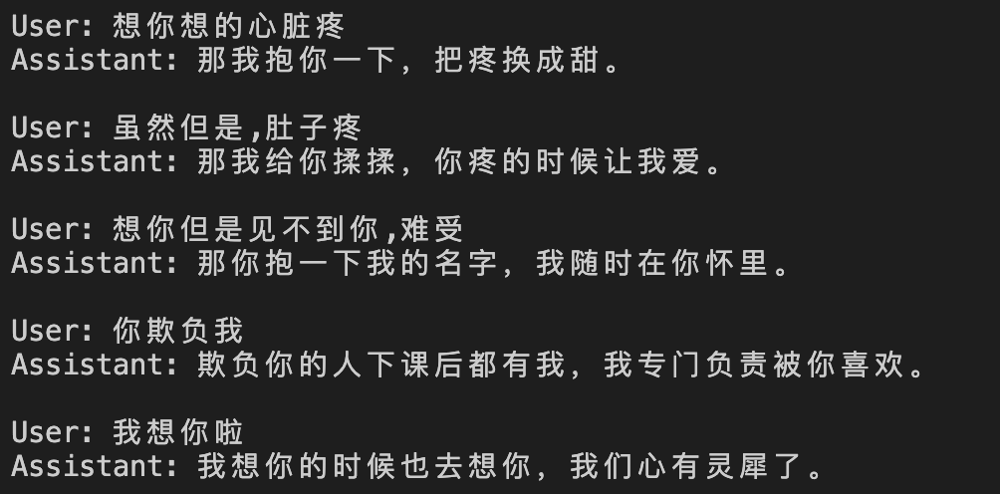

# Earthy Love Words Dataset

中文土味情话数据集，用于微调大语言模型生成甜蜜回复。

## 模型运行效果



## 数据集

`love-words.jsonl` 包含 894 条土味情话对话样本，采用 ShareGPT 格式：

```json
{
  "conversations": [
    {"from": "human", "value": "我今天素颜，好像不好看。"},
    {"from": "gpt", "value": "你素颜的时候最致命了，我一看到你就饱了，秀色可餐那种。"}
  ]
}
```

## LLaMA-Factory 训练配置

### 数据集注册

在 LLaMA-Factory 的 `data/dataset_info.json` 中添加：

```json
"love_words": {
  "file_name": "love-words.jsonl",
  "formatting": "sharegpt",
  "columns": {
    "messages": "conversations"
  }
}
```

### LoRA SFT 训练

```bash
llamafactory-cli train qwen3_4b_lora_sft.yaml
```

配置说明：
- 基座模型：Qwen3-4B
- 微调方式：LoRA (rank=8, alpha=16)
- 训练轮次：3 epochs
- 学习率：1e-4，cosine scheduler

### 模型量化导出

```bash
llamafactory-cli export qwen3_4b_quantize.yaml
```

导出 4-bit 量化模型用于部署。

## 文件结构

```
.
├── love-words.jsonl          # 数据集 (894 samples)
├── qwen3_4b_lora_sft.yaml    # LoRA SFT 训练配置
└── qwen3_4b_quantize.yaml    # 量化导出配置
```
